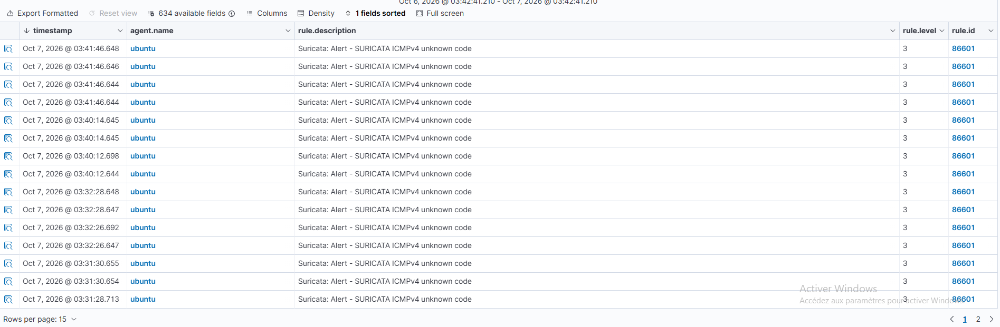
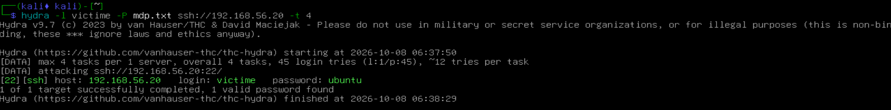
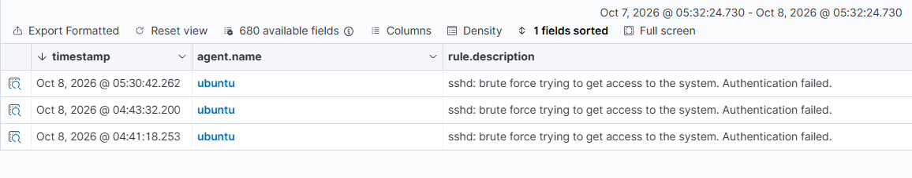
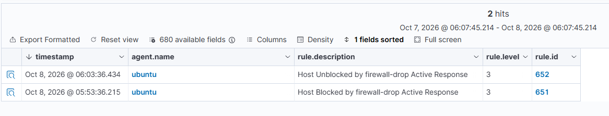
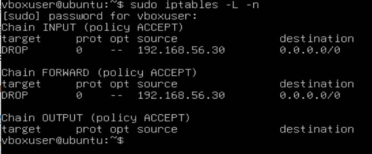
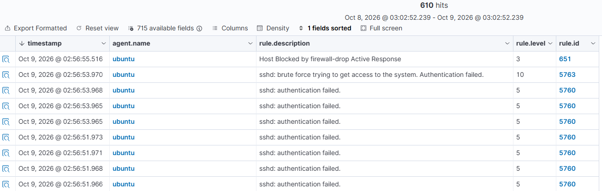
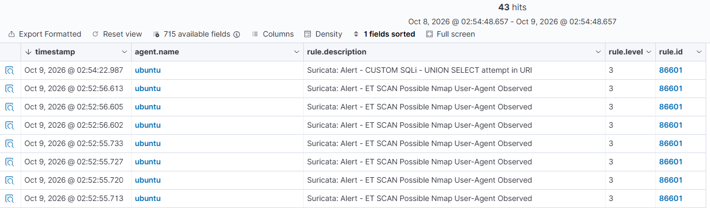

# Intrusion Detection Lab with SIEM — Suricata + Wazuh

## Objective

Build a small virtualized environment to monitor a network with **Suricata** (network-based detection) and **Wazuh** (SIEM, host-based detection, correlation and active response), then carry out several real attacks against that network and document precisely how each one was detected.

The goal isn't just to show that detection works "out of the box," but to understand its limits (what isn't detected by default) and address them with custom rules and automated response.

## Architecture

4 virtual machines under VirtualBox, connected through an isolated *host-only* internal network (`192.168.56.0/24`), each also given a NAT adapter for internet access (updates only).

| Machine | OS | RAM | vCPU | IP (host-only) | Role |
|---|---|---|---|---|---|
| Wazuh | OVA appliance | 4 GB | 4 | 192.168.56.102 | Manager, indexer, dashboard |
| Target | Ubuntu Server 24.04 LTS | 2 GB | 2 | 192.168.56.20 | Wazuh agent, Suricata, Apache, SSH, DVWA |
| Attacker | Kali Linux (headless) | 1 GB | 2 | 192.168.56.30 | Attack tools (Nmap, Hydra, etc...) |
| Host PC | — | — | — | 192.168.56.1 | Browser used to reach the dashboard and DVWA |

*(Detailed network diagram: see `network-diagram.png`)*

**Hardware constraint**: the whole lab was designed to run on a host machine with 16 GB of RAM (i5-12400F), hence the deliberately limited resources allocated to each VM.

## Setup

1. Deployed the 4 VMs under VirtualBox, configured host-only + NAT networking.
2. Installed the official Wazuh OVA appliance.
3. Installed Ubuntu Server 24.04 LTS as the target, with:
   - Wazuh agent (official APT repository, registered with the manager)
   - Suricata (Emerging Threats ruleset + custom rules)
   - Apache, MariaDB, PHP + DVWA (Damn Vulnerable Web Application)
4. Log integration: `eve.json` (Suricata) and `access.log` (Apache) forwarded to Wazuh through the agent (`ossec.conf` → `<localfile>`).
5. Installed Kali Linux in terminal-only mode (no GUI) as the attacking machine.

## Attacks performed and detection

| # | Attack | Command | Detection | Source | Rule ID / SID | MITRE ATT&CK |
|---|---|---|---|---|---|---|
| 1 | Port scan | `nmap -sS -p 1-1000 <target>` | Suricata (custom rule) | `eve.json` → Wazuh dashboard | sid **1000003** | T1046 — Network Service Discovery |
| 1b | Service-detection scan | `nmap -sV -A <target>` | Suricata (default Emerging Threats rule) | `eve.json` → Wazuh dashboard | signature_id **2024364** | T1046 |
| 2 | SSH brute force | `hydra -l victime -P mdp.txt ssh://<target>` | Wazuh (authentication log analysis) | journald/auth.log | rule.id **5763** | T1110 — Brute Force |
| 2b | SSH brute force (network layer) | same | Suricata (custom rule, connection-rate threshold) | `eve.json` → Wazuh dashboard | sid **1000004** | T1110 |
| 2c | Automated response | triggered after 8 failures within 2 minutes | Wazuh Active Response — source IP blocked via iptables (`firewall-drop`), automatically unblocked after 10 minutes | `active-responses.log` → Wazuh dashboard | rule.id **651 / 652** | Mitigation (NIST SI.4) |
| 3 | SQL injection (UNION-based) | request against DVWA (`vulnerabilities/sqli`) | Wazuh (Apache log analysis) **and** Suricata (custom rule) | `access.log` + `eve.json` → Wazuh dashboard | rule.id **31106** / sid **1000001** | T1190 — Exploit Public-Facing Application |

## Screenshots

This image shows the detection of a nmap scan on the agent


This image shows the ssh brute force attack being successful


This image shows the detection of a ssh brute force attack on the agent


This image shows the agent blocking the IP of the attacker before unblocking it a few minutes later


This image shows the agent's firewall successfully blocking the attacker's IP


These images shows the ssh brute force attack failing




This image shows the agent detection a nmap scan and an SQL injection attack 


## Custom Suricata rules

File: `suricata/custom.rules`

```
# SQLi - UNION SELECT in the URI
alert http any any -> $HOME_NET any (msg:"CUSTOM SQLi - UNION SELECT attempt in URI"; flow:to_server,established; http.uri; content:"UNION"; nocase; content:"SELECT"; nocase; distance:0; classtype:web-application-attack; sid:1000001; rev:1;)

# Nmap scan (SYN packet threshold)
alert tcp any any -> $HOME_NET any (msg:"CUSTOM Possible Nmap SYN scan detected"; flags:S; threshold:type both, track by_src, count 10, seconds 5; classtype:attempted-recon; sid:1000003; rev:2;)

# SSH brute force (network connection-rate threshold)
alert tcp any any -> $HOME_NET 22 (msg:"CUSTOM Possible SSH brute force - high connection rate"; flow:to_server; flags:S; threshold:type both, track by_src, count 8, seconds 20; classtype:attempted-recon; sid:1000004; rev:1;)
```

These rules fill gaps left by the default ruleset: for example, a simple manual SQL injection (`UNION SELECT` style) isn't always covered by standard Emerging Threats rules, which mostly target automated tools (sqlmap) or more specific patterns.

## Active response (Wazuh)

Configuration added to `ossec.conf` (manager):

```xml
<command>
  <name>firewall-drop</name>
  <executable>firewall-drop</executable>
  <timeout_allowed>yes</timeout_allowed>
</command>

<active-response>
  <disabled>no</disabled>
  <command>firewall-drop</command>
  <location>defined-agent</location>
  <agent_id>001</agent_id>
  <rules_id>5763</rules_id>
  <timeout>600</timeout>
</active-response>
```

After 8 failed SSH authentication attempts within less than 2 minutes (rule 5763), the source IP is automatically blocked via `iptables` on the target machine, then unblocked after 10 minutes.

## Challenges encountered and resolved

- **Silent active response**: the `<active-response>` block had been left commented out by mistake in `ossec.conf`, preventing execution despite detection working correctly — diagnosed by comparing manager and agent logs.
- **SSH correlation rule**: the official rule 5720 didn't match the rule chain actually triggered in this Wazuh version (4.14); the correct rule (5763) was identified by inspecting the ruleset directly.

## Possible improvements

- Extend the custom Suricata rules (encoding variants, other injection patterns).
- Add an active response for web attacks (block after repeated SQLi detections).
- Centralize more logs (MariaDB logs, full system logs).

## Stack used

- VirtualBox
- Wazuh 4.14 (manager + agent)
- Suricata (Emerging Threats ruleset + custom rules)
- Kali Linux
- Ubuntu Server 24.04 LTS, Apache, MariaDB, DVWA
